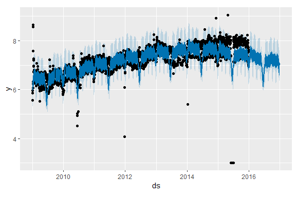
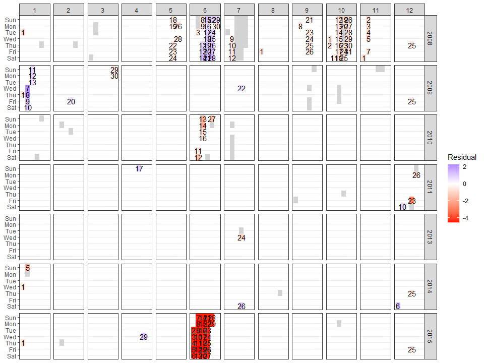
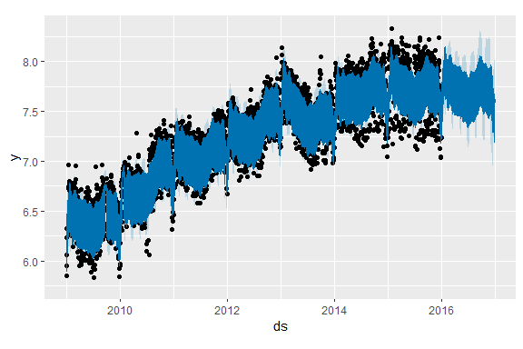

<!-- README.md is generated from README.Rmd. Please edit that file -->

# prophetExt: Additional Features for Prophet Time-Series Forecasting

<!-- badges: start -->

<!-- badges: end -->

## Installation

You can install the development version of prophetExt like so:

``` r
remotes::install_github("hoxo-m/prophetExt")
```

## Example

This is a basic example which shows you how to solve a common problem:

``` r
df <- read.csv("https://raw.githubusercontent.com/facebook/prophet/master/examples/example_wp_log_R_outliers2.csv", skip = 337, col.names = c("ds", "y"))
head(df)
#>           ds        y
#> 1 2009-01-29 6.775366
#> 2 2009-01-19 6.799056
#> 3 2009-01-18 6.270988
#> 4 2009-01-13 7.197435
#> 5 2009-01-12 7.270313
#> 6 2009-01-11 6.710523
```

``` r
library(prophet)

model <- prophet(df)
df_future <- make_future_dataframe(model, 365)
fore <- predict(model, df_future)

plot(model, fore)
```

<!-- -->

``` r
library(prophetExt)

outliers <- detect_outliers(model)

plot(model, fore) + autolayer(outliers)
```

<!-- -->

``` r
plot_residuals_calendar(outliers)
```

<!-- -->

``` r
df$y[df$ds %in% outliers$ds] <- NA

model <- prophet(df)
df_future <- make_future_dataframe(model, 365)
fore <- predict(model, df_future)

plot(model, fore)
```

<!-- -->
